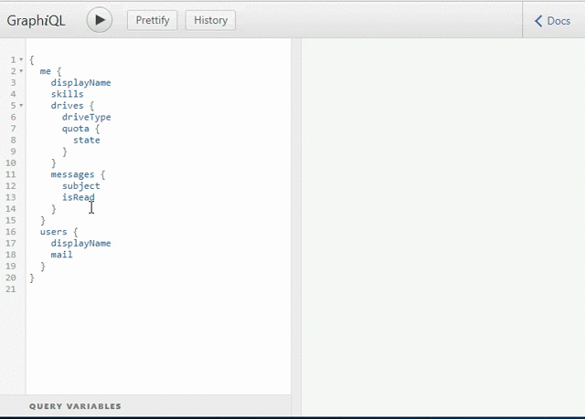

# GraphQL for Microsoft Graph (DEMO)

**Note:** This repo is based on an [archived Microsoft project](https://github.com/microsoftgraph/graphql-demo). I'm just having fun learning Node and GraphQL. Security vulnerabilities may exist in the project, or its dependencies. If you plan to reuse or run any code from this repo, be sure to perform appropriate security checks on the code or dependencies first.

## About
This is a *demo* that enables basic, read-only querying of the [Microsoft Graph API](https://developer.microsoft.com/en-us/graph/) using [GraphQL query syntax](http://graphql.org/learn/queries/). GraphQL enables clients to request exactly the resources and properties that they need instead of making REST requests for each resource and consolidating the responses. To create a GraphQL service, this demo translates the [Microsoft Graph OData $metadata document](https://graph.microsoft.com/v1.0/$metadata) to a GraphQL schema and generates the necessary resolvers. Please note we are providing this demo code for evaluation as-is. 



## Installation
1. Clone the repository
2. Install dependencies (`npm install`)
3. Generate schema description and resolver code using `npm run build`
4. Navigate to the [App Registration Portal](https://apps.dev.microsoft.com/), set up a [new web app](https://docs.microsoft.com/en-us/azure/active-directory/develop/active-directory-v2-app-registration) with the following delegated API Permissions:
   - *openid*
   - *profile*
   - *User.ReadWrite*
   - *User.Read.All*
   - *Sites.ReadWrite.All*
   - *Contacts.ReadWrite*
   - *Calendars.Read*
   - *Mail.Read*
   - *Device.Read*
   - *Files.Read.All*
   - *Mail.Read.Shared*
   - *People.Read*
   - *Notes.Read.All*
   - *Tasks.Read*
   - *Mail.ReadWrite*
5. Grant Admin consent for the added permission
6. Copy index.html.example to index.html and configure App Id and redirect URIs in the applicationConfig variable
7. Run `npm start` and go to `http://localhost:1337`

## Sample requests
#### Fetch recent emails

```graphql

{
  me {
    displayName
    officeLocation
    skills
    messages {
      subject
      isRead
      from {
        emailAddress {
          address
        }
      }
    }
  }
}
```


#### Fetch groups and members
```graphql
{
  groups {
    displayName
    description
    members {
      id
    }
  }
}
```

#### Fetch files from OneDrive
```graphql
{
  me {
    drives {
      quota {
        used
        remaining
      }
      root {
        children {
          name
          size
          lastModifiedDateTime
          webUrl
        }
      }
    }
  }
}
```

## How it works
* src/setup.js reads in a well-formed $metadata CSDL, parses it and builds up a GraphQL schema
* src/setup.js code generates resolvers that naively issues requests to the Graph service when the previous (parent) resolver doesn't have the data at hand

## Limitations/to-dos
* [x] Translate OData inheritance relationships
* [x] Enable passing arguments (id for indexing into collections)
* [ ] Support pagination
* [ ] Implement mutations
* [ ] Enable passing arguments for sort, filter
* [ ] Add heuristics for $expand to reduce number of service calls made